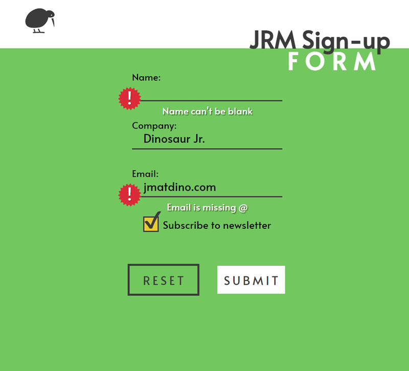

Live demo - [🔗Link🔗](https://inspiring-kirch-10373d.netlify.app/)

My goal was to build a form in React making use of controlled components. I implemented custom validation for all the fields, with distinct error messages for each field and three different messages for the email. The form is easily scalable, fully responsive, keyboard accessible. When all fields are validated, the form is submitted and pushes to a confirmation screen. 

Styled only using styled-components.

Designed in Figma - [🔗Link🔗](https://www.figma.com/file/jadwrrrXhjyU1q11e0xCyX/SIA-form)

>
